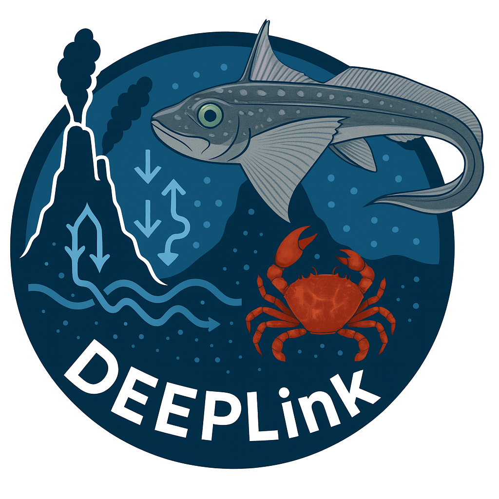
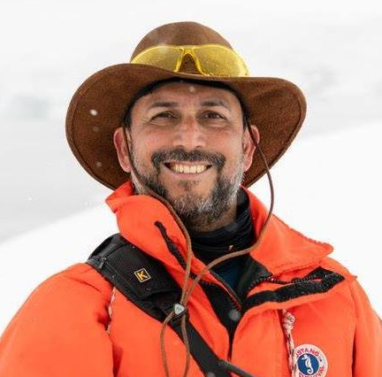
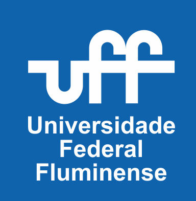
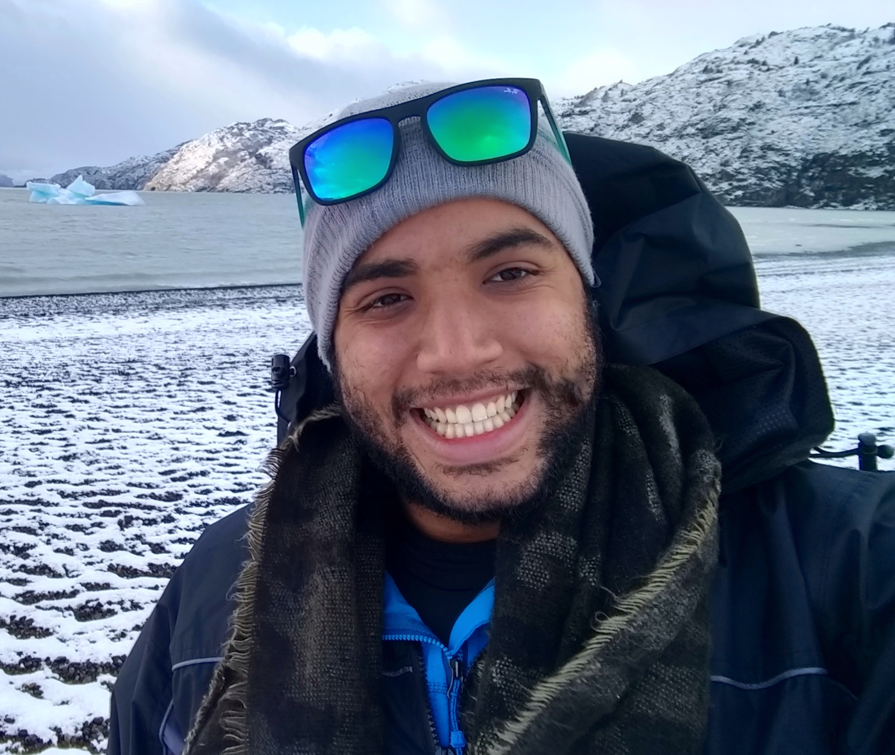
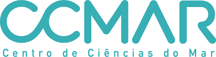
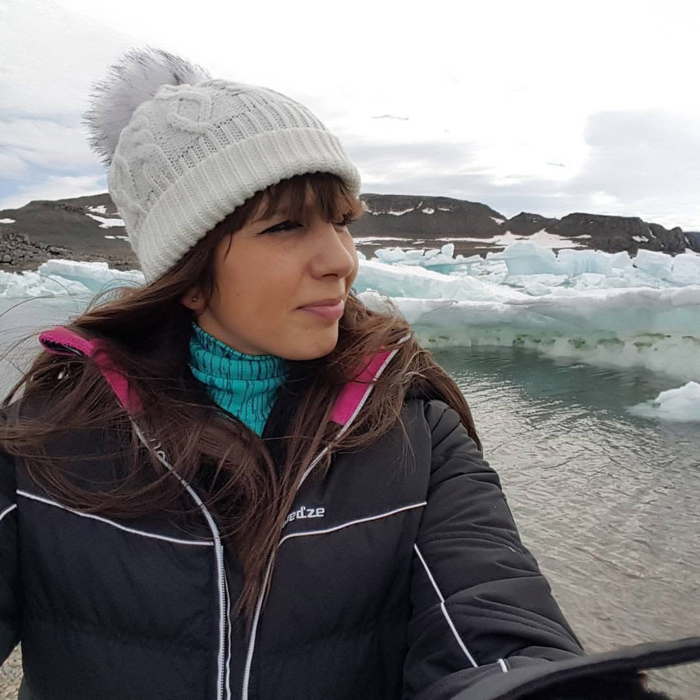
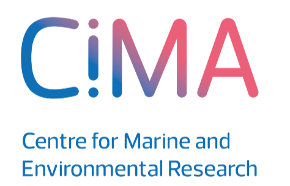

<table>
<tr>
<td></td>
<td>

# DEEPLinK  
**Deep-sea Ecotoxicological and Environmental Patterns: Linking Insights for New Knowledge**

</td>
</tr>
</table>

## Overview

The **DEEPLINK** project investigates deep-sea ecotoxicological and environmental patterns across the South Atlantic, aiming to bridge scientific, technological, and regional gaps in our understanding of vulnerable marine ecosystems. The project focuses on integrating physical, chemical, molecular and omics-based observations to assess contamination impacts and adaptive responses of deep-sea and polar invertebrates.

DEEPLINK is rooted in the principles of the **UN Decade of Ocean Science for Sustainable Development (2021–2030)**, contributing to its vision of *“the science we need for the ocean we want”* through open data, inter-basin collaboration, and transdisciplinary research.

## Our Scientific Objectives

- **Assess ecotoxicological thresholds** of cold-adapted species (e.g., sea anemones, amphipods) under scenarios of metal contamination and ocean warming;
- **Compare biological responses** between ecosystems under similar pressures (e.g., King George Island and polymetallic nodule zones);
- **Identify biomarkers** for early detection of environmental stress in the deep sea;
- **Generate high-resolution omics datasets** for poorly studied species with ecological and conservation relevance;
- **Support environmental risk assessment** for deep-sea mining and contaminated polar environments.

## Strategic Purpose

DEEPLINK connects observations and methodologies across different latitudes and ocean basins—from Antarctica to the eastern and western South Atlantic—helping to:

- Foster equitable participation of South American and Southern Hemisphere institutions in global ocean science;
- Contribute data, indicators, and frameworks to ongoing **Decade Actions**, such as DOOS and the All-Atlantic Ocean Research Alliance;
- Provide actionable scientific knowledge for conservation strategies and future policy dialogues.

## Contribution to the UN Ocean Decade

DEEPLINK embodies the **collaborative ethos** of the Ocean Decade by:

- Engaging institutions from Brazil, Portugal, and beyond;
- Building capacity for early-career researchers through joint fieldwork, training, and data sharing;
- Advancing interoperable, open-access data for long-term global observation programs;
- Linking polar, deep-sea, and subtropical research networks under a common framework of **inter-basin connectivity**.

---

## Project Team
<table>
  <tr>
    <th align="center">Name</th>
    <th align="center">Institution</th>
  </tr>
  <tr>
    <td align="center" valign="middle">
      <strong>André Belém</strong> 
       
      <a href="mailto:andrebelem@id.uff.br">andrebelem@id.uff.br</a>
    </td>
    <td align="center" valign="middle">
      Observatório Oceanográfico, UFF (Brazil) 
      
    </td>
  </tr>
  <tr>
    <td align="center" valign="middle">
      <strong>Caio C. Ribeiro</strong> 
       
      <a href="mailto:ccribeiro@ualg.pt">ccribeiro@ualg.pt</a>
    </td>
    <td align="center" valign="middle">
      CCMAR, Universidade do Algarve (Portugal) 
      
    </td>
  </tr>
  <tr>
    <td align="center" valign="middle">
      <strong>Cármen Sousa</strong> 
       
      <a href="mailto:csvsousa@ualg.ptt">csvsousa@ualg.pt</a>
    </td>
    <td align="center" valign="middle">
      CIMA, Universidade do Algarve (Portugal) 
      
    </td>
  </tr>
</table>

---

## Contact
For inquiries or collaborations, please contact the participants by email.

